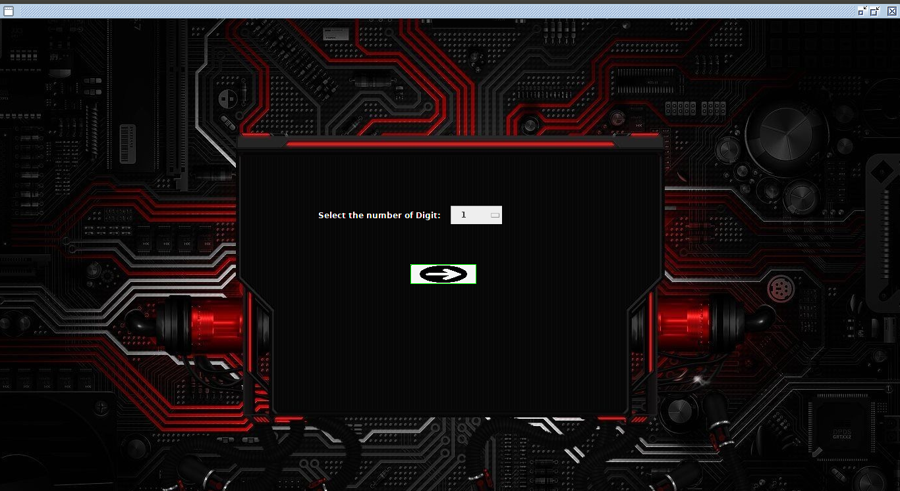
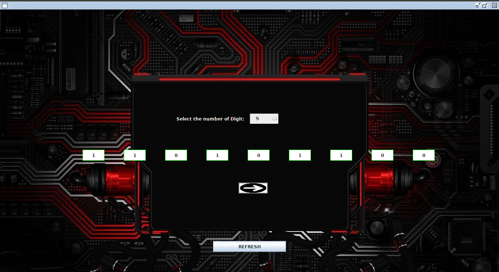
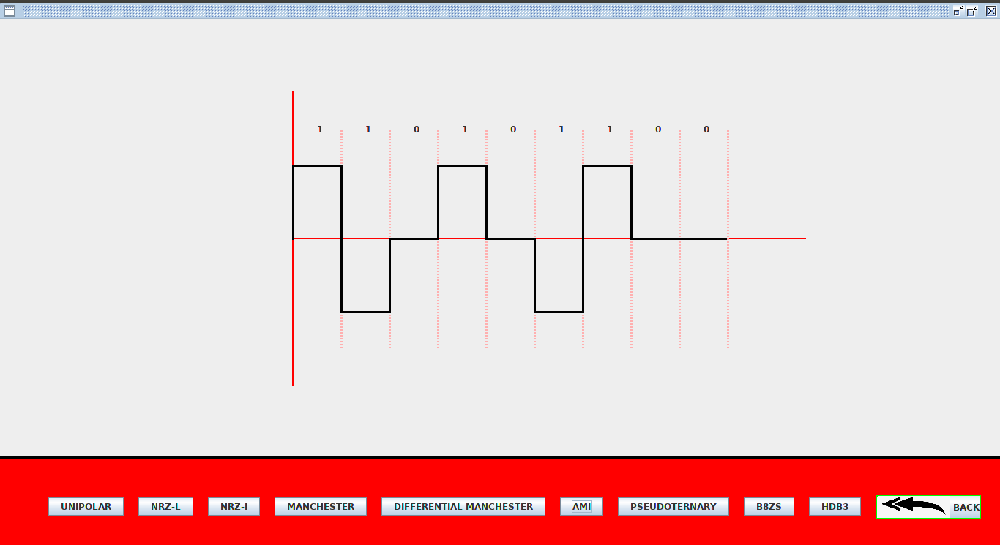

# Line-Encoding

This is the implementation of Line Encoding through Graph.

### _Images_









Takes binary Number as Input and Return Different types of encoding of this Input.

Unipolar

NRZ-I

NRZ-L

Manchester

DIffmanchester

AMI

Pseudoter


To Run this :

```java

>javac First.java

>java First

```
